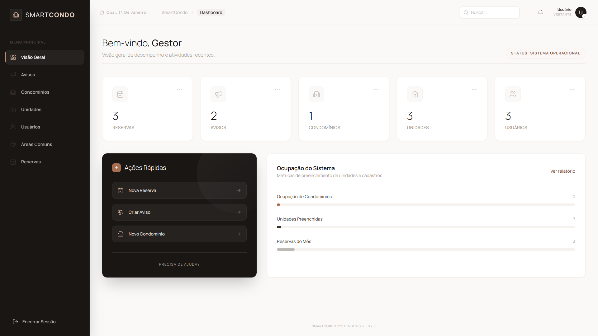
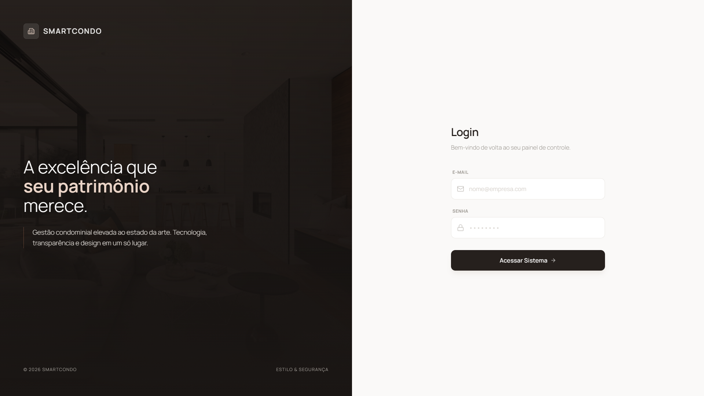
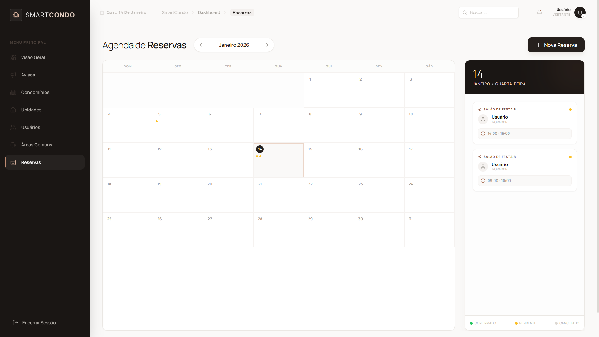
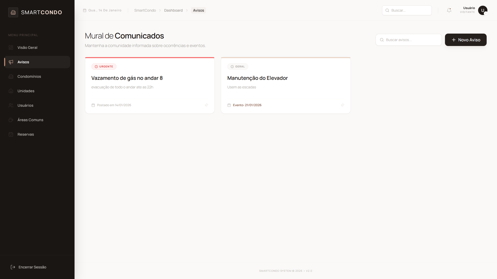

<div align="center">
  

  <h1>🏢 SmartCondo</h1>

  <p>
    <strong>Sistema SaaS para Gestão Inteligente de Condomínios</strong>
  </p>

  <p>
    
    
    
    
    
  </p>
  
  <p>
    <em>"A excelência que seu patrimônio merece."</em>
  </p>
</div>

---

## 📖 Sobre o Projeto

O **SmartCondo** é uma plataforma *full-stack* desenvolvida sob arquitetura **Monorepo (TurboRepo)**, projetada para unir a gestão administrativa (moradores, unidades) com a operacional (reservas, comunicação) em um ecossistema robusto e seguro.

O diferencial do projeto está na experiência do usuário (UX), utilizando um **Design System personalizado** com paleta de cores sofisticada (Stone, Clay & Espresso), fugindo do padrão azul corporativo e oferecendo uma interface elegante e minimalista.

---

## 📸 Galeria & Funcionalidades

### 🔐 Segurança e Acesso
**Login Seguro:** Autenticação via JWT com interceptors no frontend para gestão automática de sessão. Interface limpa focada em conversão.

<div align="center">
  
</div>

### 📅 Gestão de Reservas (Conflito Zero)
**Agendamento Inteligente:** Sistema de reservas para áreas comuns (Salão de Festas, Academia). O backend valida automaticamente conflitos de horário, regras de antecedência e bloqueia datas indisponíveis.

<div align="center">
  
</div>

### 📢 Mural Digital
**Comunicação Eficiente:** Mural de avisos com distinção visual clara entre comunicados **Gerais** (Informativos) e **Urgentes** (Alertas de segurança/manutenção crítica).

<div align="center">
  
</div>

---

## 🏗️ Arquitetura do Monorepo

O projeto utiliza **TurboRepo** para orquestrar o build e compartilhar configurações, garantindo tipagem de ponta a ponta (End-to-End Type Safety).

```bash
.
├── apps
│   ├── api          # Backend (NestJS + Swagger + Class Validator)
│   └── web          # Frontend (Next.js 15 + Tailwind v4 + React Hook Form)
├── packages
│   └── database     # Schema do Prisma, Migrations e Cliente tipado

```

---

## 🛠️ Tech Stack

### 🎨 Frontend (`apps/web`)

* **Framework:** Next.js 15 (App Router)
* **Estilização:** Tailwind CSS v4 (Design System Customizado)
* **Componentes:** Lucide React (Ícones), Radix UI (Primitivos)
* **Gerenciamento de Estado:** Hooks customizados + Context API
* **HTTP Client:** Axios com interceptors de Auth

### ⚙️ Backend (`apps/api`)

* **Framework:** NestJS (Modular Monolith)
* **Database:** PostgreSQL (Neon Tech)
* **ORM:** Prisma
* **Validação:** `class-validator` & `class-transformer`
* **Documentação:** Swagger (OpenAPI)

---

## ⚡ Como Rodar o Projeto

### Pré-requisitos

* Node.js (v18+)
* Gerenciador de pacotes (`npm` ou `pnpm` recomendado)
* Banco de dados PostgreSQL rodando (Docker ou Cloud)

### 1. Configuração de Ambiente

Crie os arquivos `.env` na raiz de `apps/api`, `apps/web` e `packages/database` com as credenciais do banco e segredos JWT.

### 2. Instalação e Setup

```bash
# 1. Instalar dependências na raiz do monorepo
npm install

# 2. Gerar o cliente do Prisma (dentro de packages/database)
npx prisma generate

# 3. Sincronizar o schema com o banco de dados
npx prisma db push

```

### 3. Executando (Modo Desenvolvimento)

```bash
# Na raiz do projeto, este comando inicia Frontend e API simultaneamente
npm run dev

```

* **Frontend:** [http://localhost:3001](https://www.google.com/search?q=http://localhost:3001)
* **API:** [http://localhost:3000](https://www.google.com/search?q=http://localhost:3000)
* **Swagger Docs:** [http://localhost:3000/api](https://www.google.com/search?q=http://localhost:3000/api)

---

## 🔮 Roadmap (Próximos Passos)

* [ ] **Portaria:** Controle de entrada/saída de visitantes e encomendas.
* [ ] **Dashboard Analytics:** Gráficos avançados de ocupação e financeiro.
* [ ] **App Mobile:** Versão React Native para moradores.

---

<div align="center">
<p>Desenvolvido com 🤎 por <strong>Fátima Dachari</strong></p>
